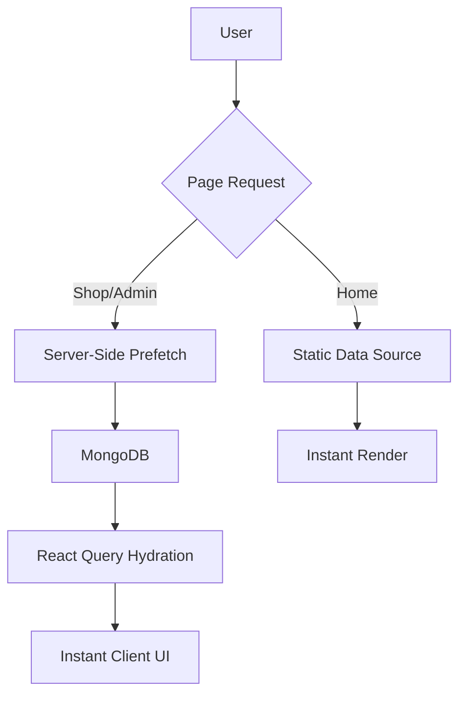

# KOKO Walkers 👟

A premium, high-performance e-commerce prototype for custom footwear. Built with a "recruiters-first" mindset, focusing on visual excellence, buttery-smooth transitions, and state-of-the-art perceived performance.

## 🚀 Key Features

- **Instant SSR Hydration**: Zero-flicker transitions using Next.js Server Components prefetched into TanStack React Query `initialData`.
- **High-Performance Navigation**: Optimized App Router transitions with a custom "KOKO" loading sequence.
- **Admin Dashboard**: Full CRUD management for products, users, and orders, directly linked to a consolidated MongoDB database.
- **Hybrid Data Strategy**:
  - **Home Page**: Lightning-fast static data source.
  - **Shop & Admin**: Live dynamic data with intelligent caching.
- **Visual Polish**:
  - Tailwind CSS v4 design system.
  - Framer Motion micro-interactions.
  - Smooth site-wide scrolling and premium typography (Syne & Inter).

## 🛠 Tech Stack

- **Framework**: Next.js 15 (App Router)
- **Styling**: Tailwind CSS v4
- **Database**: MongoDB with Mongoose
- **State Management**: TanStack React Query v5
- **Animations**: Framer Motion
- **Icons**: Lucide React
- **Notifications**: Sonner

## 📦 Getting Started

### 1. Environment Setup
Create a `.env.local` file in the root:
```env
MONGODB_URI=your_mongodb_connection_string
```

### 2. Install Dependencies
```bash
npm install
```

### 3. Initialize Database
Consolidate and seed the database with the optimized product collection:
```bash
npx tsx src/scripts/cleanup-db.ts
npx tsx src/scripts/seed.ts
```

### 4. Run Development Server
```bash
npm run dev
```

## 🏗 Project Structure

- `src/app`: Next.js App Router (Pages & API)
- `src/components`: Reusable UI components & Layouts
- `src/data`: Static product & configuration data
- `src/hooks`: Custom React hooks (React Query integrations)
- `src/models`: Mongoose database schemas
- `src/scripts`: Database maintenance & seeding tools

## 🏗 Architecture & Data Flow

The application employs a sophisticated data strategy to balance performance and dynamism:



## 🔍 SEO & Metadata
- **Dynamic SEO**: Every product detail page generates its own metadata (title, description, and images) dynamically from the database using Next.js `generateMetadata`.
- **OpenGraph**: Fully configured for social media sharing with premium branded icons.
- **Brand Consistency**: A unified title template ensures every page identifies with the KOKO Walkers brand.

## 🛠 Admin & Management
The project includes a robust administrative layer for content management:
- **Routes**: Access via `/admin` to manage inventory, view orders, and monitor users.
- **Safety Tools**: Included scripts like `cleanup-db.ts` ensure the database remains lean by automatically pruning redundant legacy collections.

## 💎 Performance Audit

| Metric | Result |
| :--- | :--- |
| **Initial LCP** | Prefetched & Server-Rendered |
| **Nav Latency** | Optimized (400ms transition cap) |
| **Hydration** | Instant via `initialData` synergy |
| **UX Feel** | Premium/Buttery |

---

*Crafted with attention to detail for recruitment assessment.*
